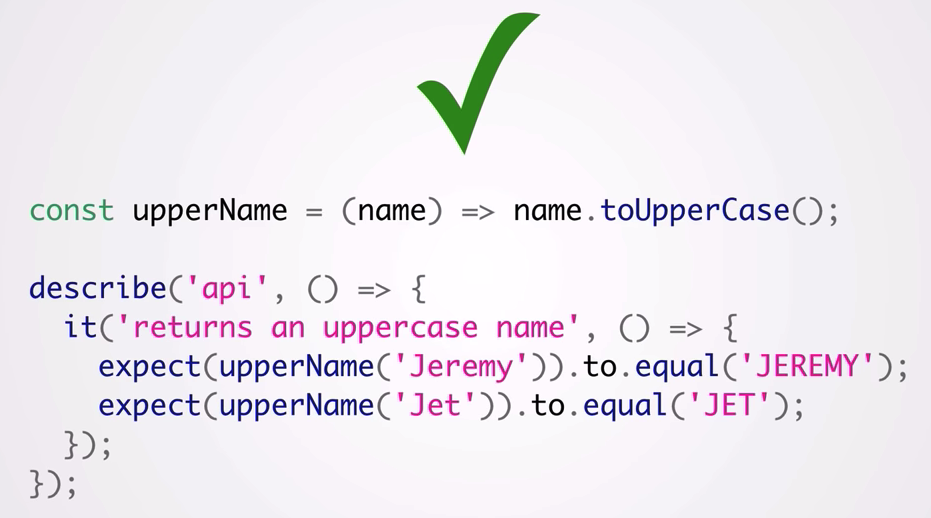

# Functional Programming Basics In ES6 by Jeremy Fairbank

<https://www.youtube.com/watch?v=FYXpOjwYzcs>

* SPEAKER: Jeremy Fairbank
* Jeremy's YouTube channel: <https://www.youtube.com/channel/UCIF0e4G6TQ7RNqauicoy10g>
* Jeremy's Twitter account: <https://twitter.com/elpapapollo>
* code: <https://github.com/jfairbank/fp-basics-in-es6>
* slides: <https://speakerdeck.com/jfairbank/scenic-city-summit-functional-programming-basics-in-es6>

## notes

### function

### why we should don't use external state

BAD

GOOD

### functional example

BAD

GOOD

### immutable vs mutable

BAD

GOOD

### Point example

BAD

GOOD

### closures

example 1

example 2

BAD

GOOD

### curring

### pipeline

### compose

triple iteration

single iteration

