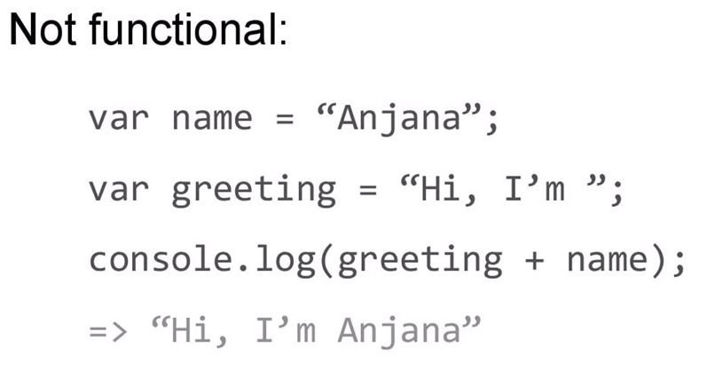
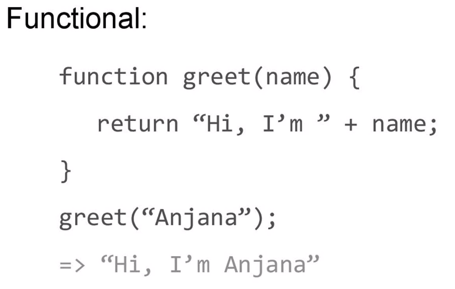
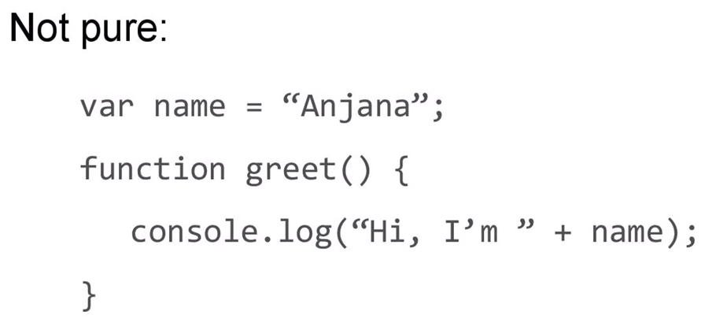
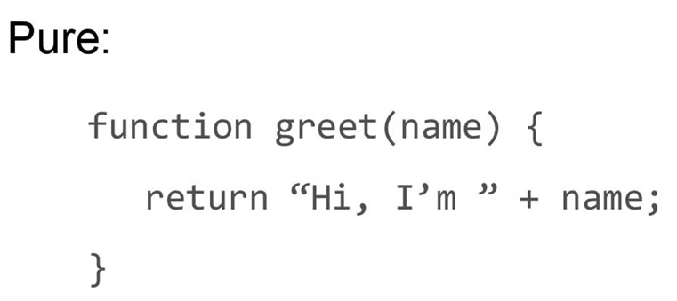
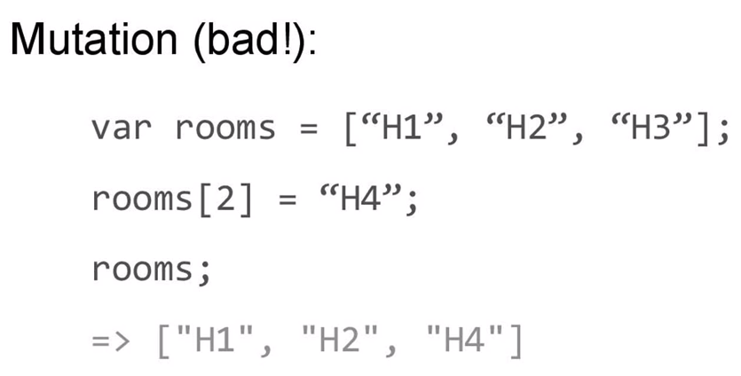
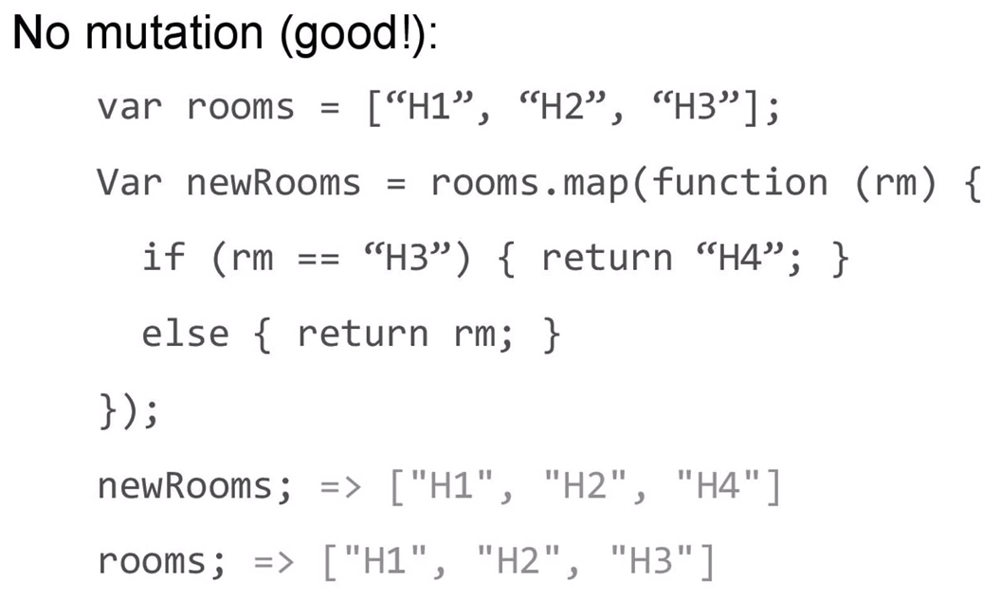
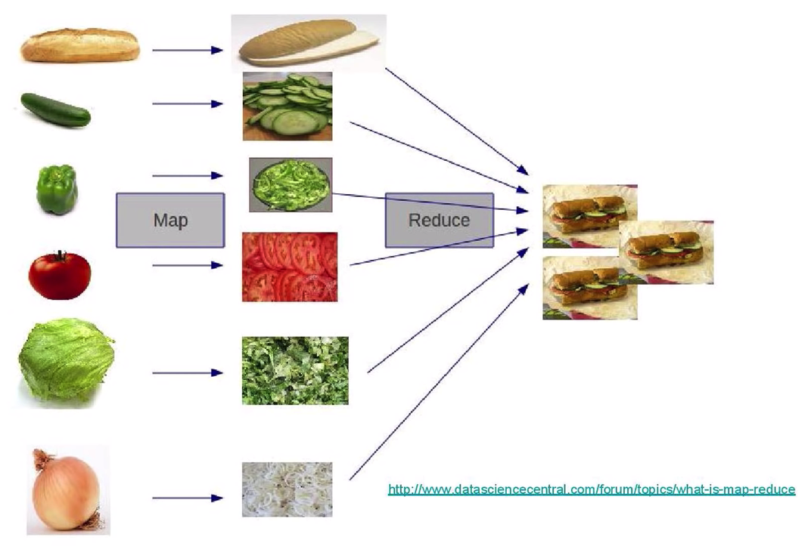

# Learning Functional Programming with JavaScript - Anjana Vakil - JSUnconf

<https://www.youtube.com/watch?v=e-5obm1G_FY>

Slides: <https://slidr.io/vakila/learning-functional-programming-with-javascript>

* avoid side effects, use pure functions
* avoid mutability, use immutable data
* Persistent data structure

### functional

BAD

GOOD

### Pure

BAD

GOOD

### not mutation

BAD

GOOD

### what is map reduce

### more

* [An introduction to functional programming](https://codewords.recurse.com/issues/one/an-introduction-to-functional-programming)

| 英文 | 中文 |
|------|------|
| mindset | 心態 |