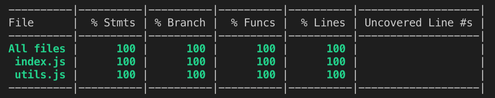
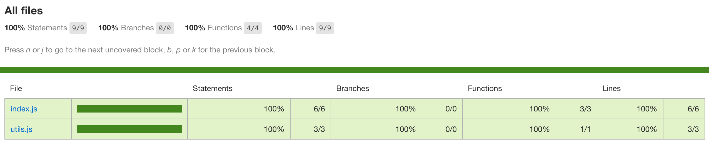

# Coverage

```sh
npm test
npm run 
```

text report



html report



### relevant project

* [Mocha](https://mochajs.org/): the fun, simple, flexible JavaScript test framework
* [istanbuljs/nyc](https://github.com/istanbuljs/nyc): the Istanbul command line interface 